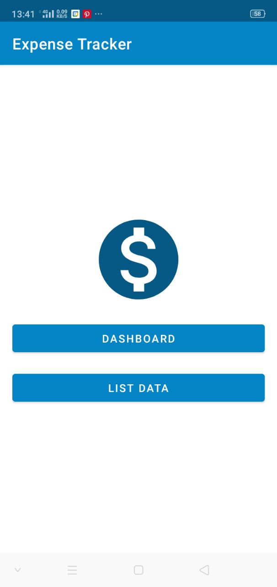
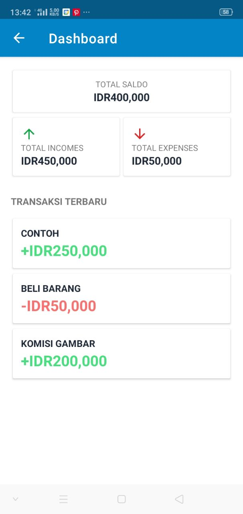
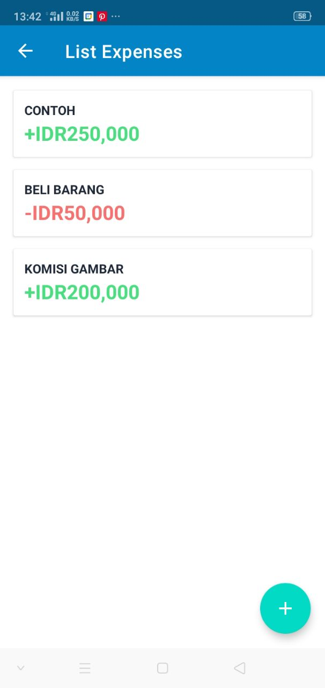
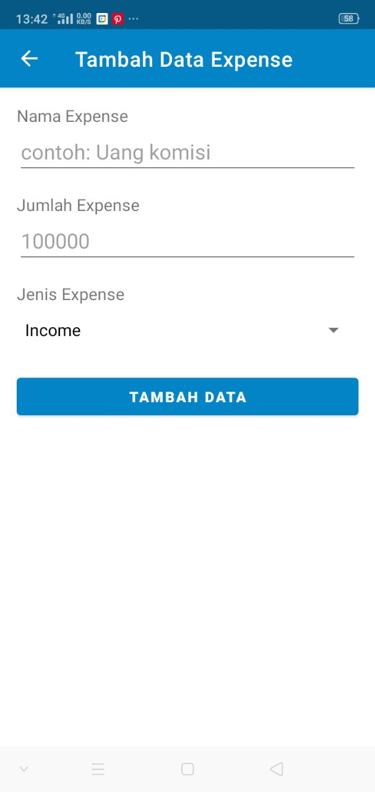
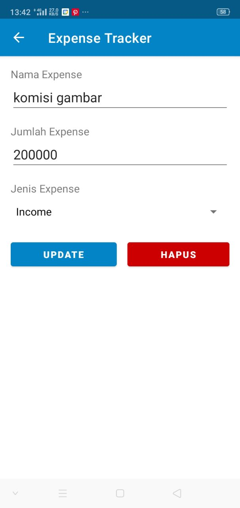

# Expesne Tracker Android

> *Aplikasi ini ditujukan sebagai tugas akhir mata kuliah "Pemrograman Berorientasi Objek" kelas 2IA02, Universitas Gunadarma.*  
> 
> Anggota Kelompok 4:
> - Audry Astridia Ismanto
> - Daffa Raditya Yandi
> - Dyodi Ramadesta S.
> - Muhammad Anugrah P. (**me**)
> - Shafa Nurul Umaya
> - Syadza Ghalda Aufa 

Aplikasi open source ini ditujukan untuk memanajemen pemasukaan dan pengeluaran pengguna. 
Spesifikasi minimum untuk menjalankan aplikasi ini:
- Minimum API: **21**
- Java version: **11 or 1.8 or up**

## Screenshot of The App
**Home**  

**Dashboard**  

**List**  

**Tambah**  

**Edit / Hapus**  
